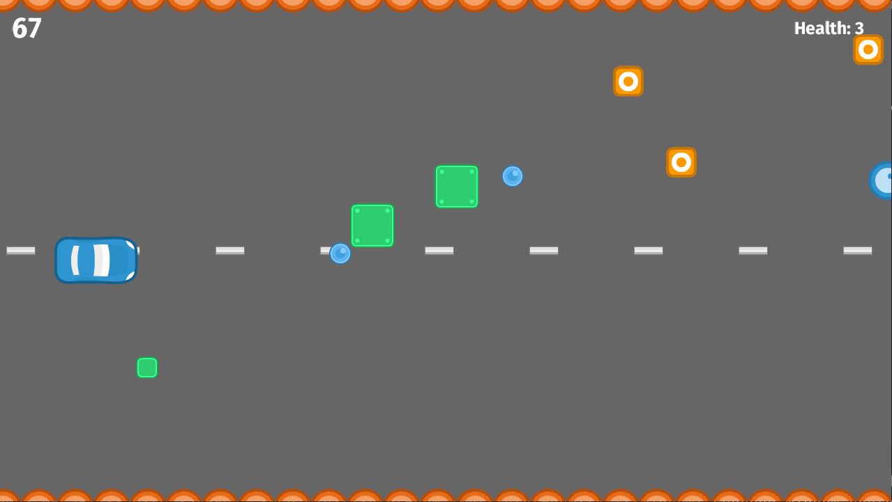

# road-racer
____

# Description
The game was built using [bevy engine](https://github.com/bevyengine/bevy) and the wrapper –
[rusty-engine](https://github.com/CleanCut/rusty_engine).

The goal of the game is to get the highest possible score.
As time goes on, the game speed and quantity of obstacles increase.



# Controls
* Use `W` or `↑` key on your keyboard to move car up and
`S` or `↓` key to move the car down;
* Press `Q` to exit the game.

# Running the game
While you're in the root directory of the project, execute:
```bash
cargo run --release
``` 

# Licence
* Sprites in `assets/sprite/racing` are adapted from Kenney [Racing Pack](https://kenney.nl/assets/racing-pack) under the [CC0 1.0 Universal license](https://creativecommons.org/publicdomain/zero/1.0/);
* Sprites in `assets/sprite/rolling` are adapted from Kenney [Rolling Ball Assets](https://kenney.nl/assets/rolling-ball-assets) pack under the [CC0 1.0 Universal license](https://creativecommons.org/publicdomain/zero/1.0/);
* Fonts in `assets/font` are licenced under [Open Font License](https://scripts.sil.org/cms/scripts/page.php?site_id=nrsi&id=OFL). You can use them in your products & projects – print or digital, commercial or otherwise.
* All audio files in `assets/audio` are licenced under CC0 licence;
* The source code of the game is licenced under [MIT licence](./LICENSE)